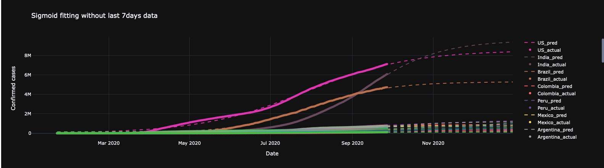
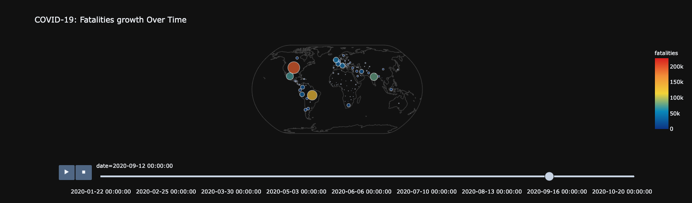
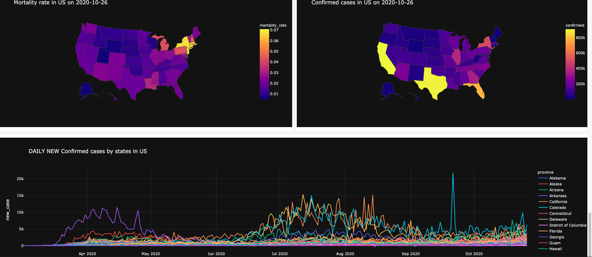
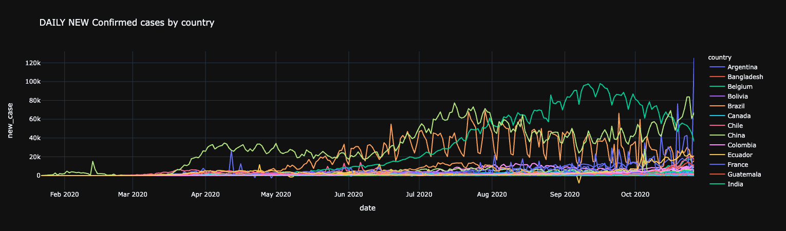
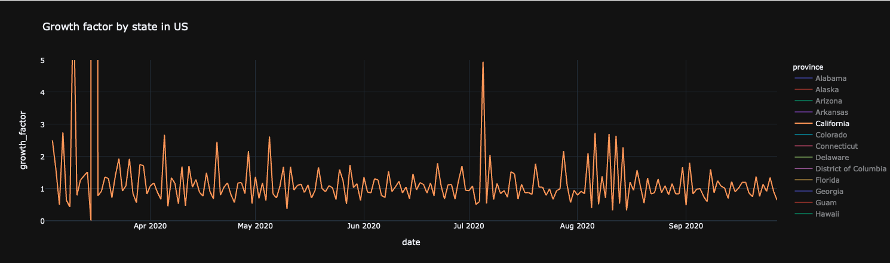
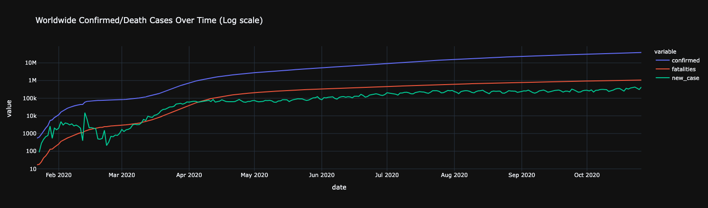
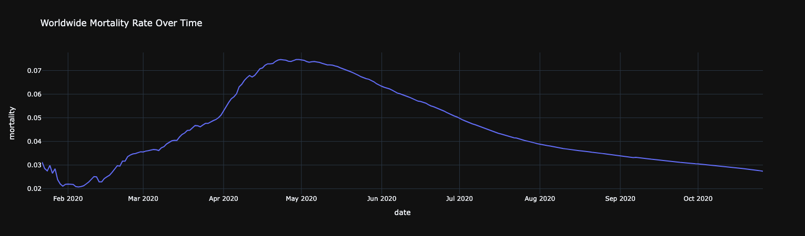

# Machine-Learning-Covid19
This Repository contains analysis of covid 19 cases worldwide and in US. It uses geospatial libraries to visualize data through interactive maps and it also uses sigmoid model to predict cases in future. It is an end to end machine learning solution.

